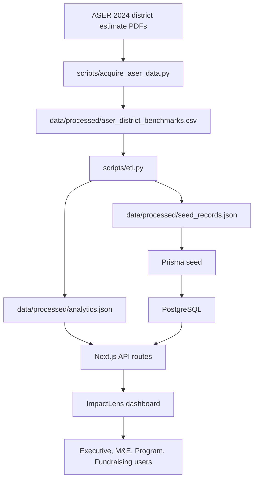
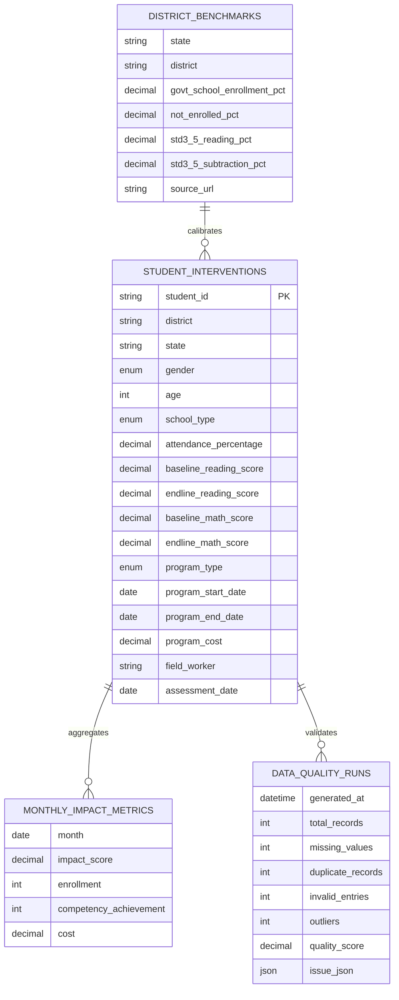

# Architecture

## System Diagram

## Runtime Design

- The dashboard can run from processed JSON for static demos and Vercel previews.
- Prisma/PostgreSQL provides the production persistence model.
- API routes expose analytics, data quality, insights, scenarios, forecast, and seed inspection.
- AI insight generation has an OpenAI-compatible adapter with deterministic fallback.

## ER Diagram

