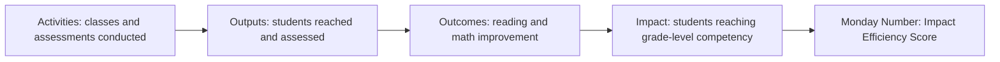

# KPI Documentation

## Impact Hierarchy



## Monday Number

**Impact Efficiency Score**

```text
Students Achieving Competency / Total Program Cost
```

Displayed in the dashboard as competency achievements per Rs. 1 lakh:

```text
Impact Efficiency Score * 100000
```

## Competency Definition

A learner achieves competency when:

```text
endline_reading_score >= 70 AND endline_math_score >= 70
```

## Executive KPIs

| KPI | Formula |
| --- | --- |
| Cost per Impact | `Total Program Cost / Students Achieving Competency` |
| Beneficiaries Reached | Count of cleaned intervention records |
| Program Completion Rate | Records where `assessment_date >= program_end_date` divided by records |
| Learning Improvement % | Avg endline score minus avg baseline score, divided by avg baseline score |
| Active Programs | Distinct count of `program_type` |

## District Impact Score

The district score combines competency achievement, reading gain, and math gain:

```text
impact_score = competency_rate * 52
             + positive_reading_gain * 0.9
             + positive_math_gain * 0.9
```

This score is used for district ranking and map color.

